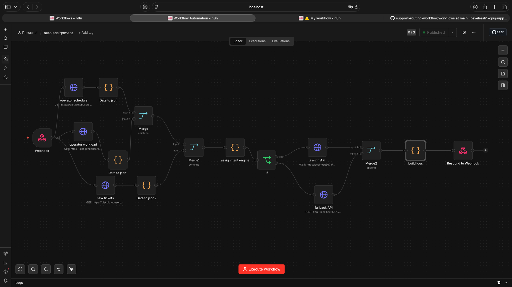

# Ticket Auto-Assignment Workflow (n8n)

## Overview

This project is a self-hosted ticket auto-assignment workflow built with n8n.

The workflow receives incoming support tickets through a webhook API, loads operators and schedules from external JSON sources, calculates ticket assignment based on business rules, and sends assignment results to mock CRM APIs.

The system also supports fallback routing and assignment logging.

---

## Features

- Webhook-based API endpoint
- Automatic ticket assignment
- Skill-based routing
- Schedule validation
- Capacity/load control
- Fallback queue support
- Assignment logging
- External JSON data sources
- Mock CRM API integration
- Self-hosted n8n setup

---

## Workflow Logic

### Assignment Rules

Tickets are assigned using:

- operator skills
- work schedule availability
- current active ticket count
- maximum allowed ticket capacity

If no suitable operator is available, the ticket is sent to a fallback queue.

---

## Architecture

```text
Webhook API
    ↓
Load external JSON data
(tickets / agents / schedules)
    ↓
Merge data
    ↓
Assignment Engine
    ↓
IF assigned_to exists
    ├─ Assign API
    └─ Fallback API
    ↓
Logging
    ↓
Webhook Response
```

---

## Example Request

```bash
curl -X POST http://localhost:5678/webhook/auto-assignment \
-H "Content-Type: application/json" \
-d '{}'
```

---

## Example Response

```json
[
  {
    "ok": true,
    "message": "ticket assigned",
    "received": {
      "ticket_id": 1001,
      "assigned_to": "pasha",
      "queue": "support",
      "priority": "high"
    }
  },
  {
    "ok": true,
    "message": "ticket sent to fallback queue",
    "received": {
      "ticket_id": 1002,
      "queue": "billing",
      "priority": "medium"
    }
  }
]
```

---

## Technologies Used

- n8n
- Docker
- Webhooks
- REST API
- JSON
- HTTP Request nodes
- JavaScript Code nodes

---

## Use Cases

- Support team automation
- Helpdesk ticket routing
- CRM workflow orchestration
- Internal operations tooling
- Queue balancing systems

---

## Future Improvements

- Database integration
- Retry logic
- SLA-based prioritization
- Real CRM integrations
- Persistent logging
- Operator status API
- Metrics dashboard


